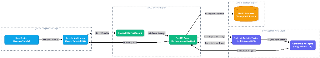

# MedAI: Intelligent Medical Assistant

MedAI is a comprehensive, end-to-end AI-powered web application designed to act as a personalized medical assistant. By bridging the gap between patients and preliminary medical knowledge using advanced Generative AI and Natural Language Processing, MedAI delivers instant, intelligent, and context-aware medical insights 24/7.

---

## Key Features
- **Intelligent Chatbot:** Conversational assistant capable of answering complex health-related queries using Google GenAI.
- **AI Symptom Checker:** Context-aware diagnostics and triage to help users understand their symptoms.
- **Toxicity Filtering:** Built-in NLP safety engine (scikit-learn, NLTK) that filters hate speech and toxic prompts in real-time.
- **Personal Dashboard:** Secure tracking of past consultations, chat history, and uploaded medical reports.
- **Emergency Protocols:** Instant first-aid guidance for severe symptoms.

---

## System Architecture & Tech Stack



### Frontend (Client Layer)
- **Framework:** [Next.js](https://nextjs.org/) (React)
- **Styling:** [Tailwind CSS](https://tailwindcss.com/)
- **UI Components:** Radix UI / shadcn

### Backend (API Layer)
- **Framework:** [FastAPI](https://fastapi.tiangolo.com/) (Python)
- **Server:** Uvicorn (Async routing)

### Intelligence Layer (AI/ML)
- **Generative AI:** Google GenAI (LLM)
- **Safety NLP:** `scikit-learn` & `NLTK` (Hate speech detection)

---

## Getting Started

Follow these instructions to get a copy of the project up and running on your local machine for development and testing purposes.

### 1. Clone the Repository
```bash
git clone https://github.com/your-username/MedAI.git
cd MedAI
```

### 2. Backend Setup (FastAPI)
Open a terminal and navigate to the `backend` directory:
```bash
cd backend
```
Create a virtual environment and activate it:
```bash
# Windows
python -m venv venv
venv\Scripts\activate

# macOS/Linux
python3 -m venv venv
source venv/bin/activate
```
Install the Python dependencies:
```bash
pip install -r requirements.txt
```
Configure Environment Variables:
- Create a `.env` file inside the `backend` directory.
- Add your Google Gemini API Key:
```env
GEMINI_API_KEY=your_gemini_api_key_here
```
Run the FastAPI server:
```bash
uvicorn main:app --reload
```
*The backend API will start running at `http://localhost:8000`*

---

### 3. Frontend Setup (Next.js)
Open a **new** terminal and navigate to the `frontend` directory:
```bash
cd frontend
```
Install the Node.js dependencies:
```bash
npm install
```
Configure Environment Variables:
- If needed, create a `.env.local` file inside the `frontend` directory.
- Add the backend API URL (default is usually fine if running locally):
```env
NEXT_PUBLIC_API_URL=http://localhost:8000
```
Run the Next.js development server:
```bash
npm run dev
```
*The frontend application will start running at `http://localhost:3000`*

---

## Disclaimer
**MedAI is designed for informational and preliminary triage purposes only.** It is not a replacement for professional medical advice, diagnosis, or treatment. Always seek the advice of your physician or other qualified health provider with any questions you may have regarding a medical condition.
